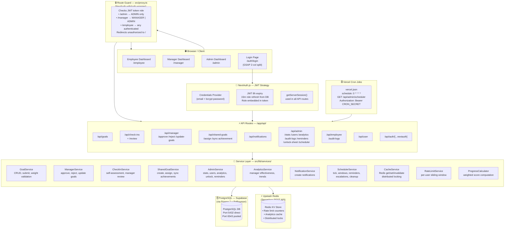
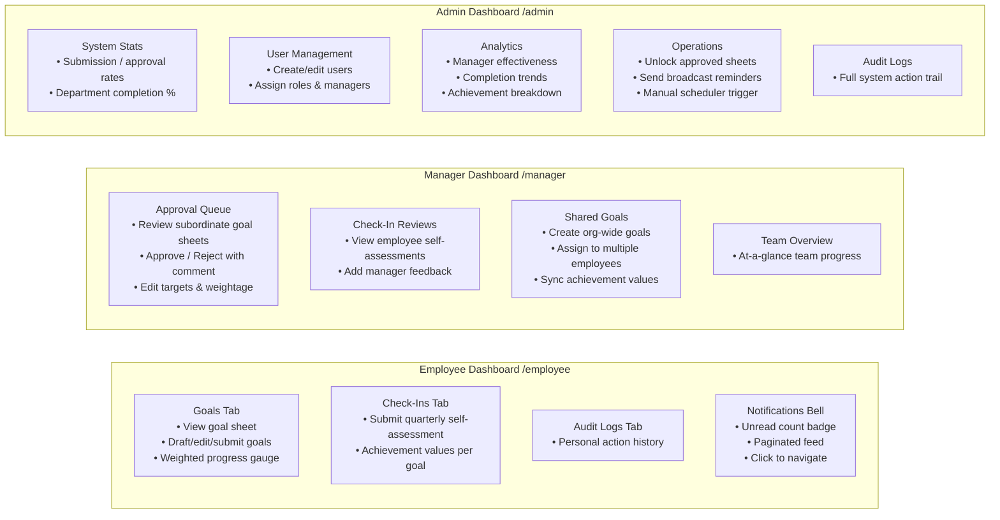
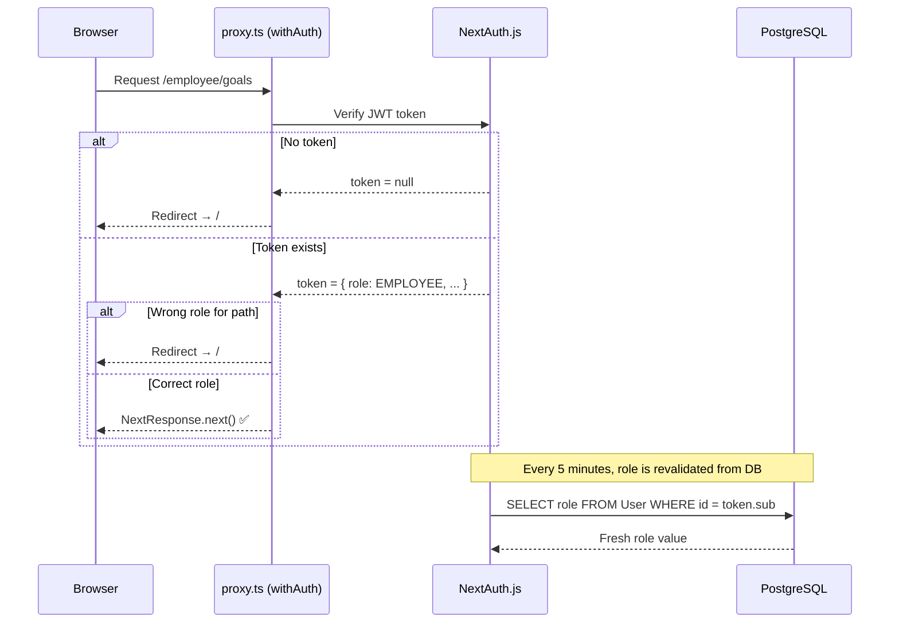
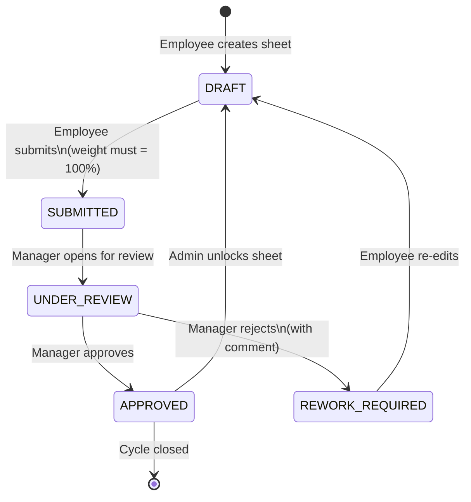
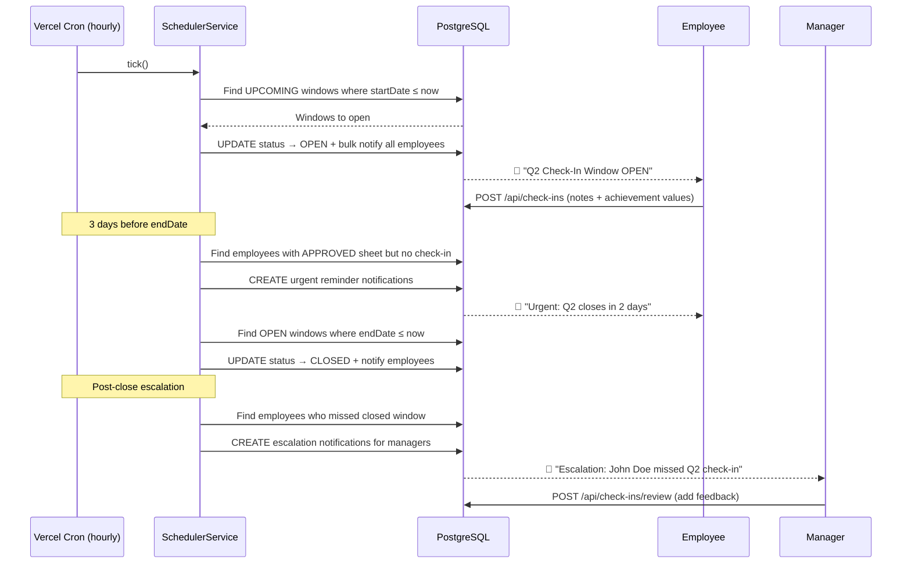
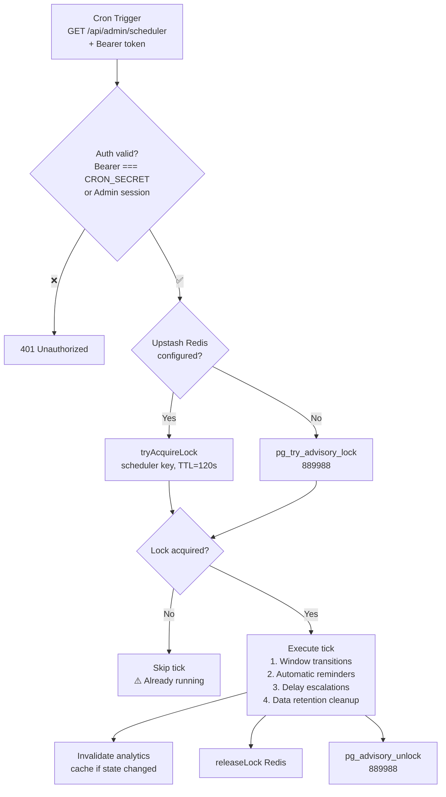
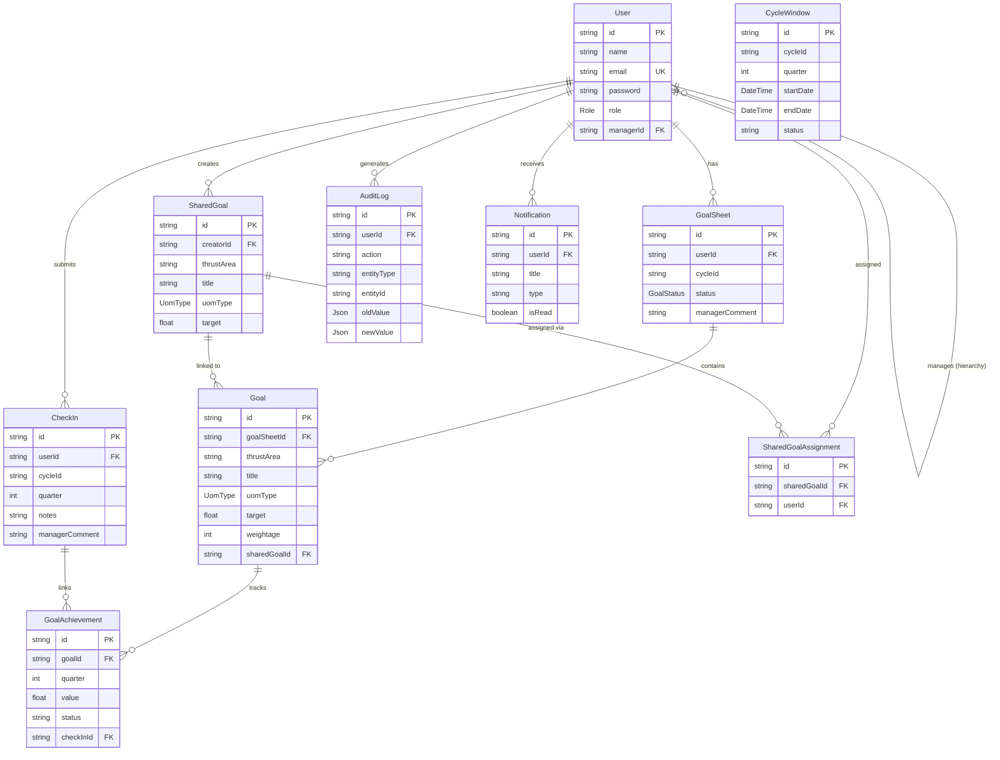
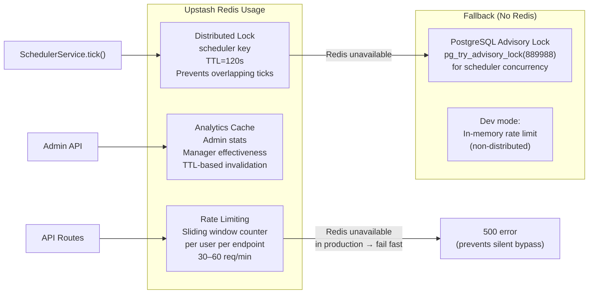
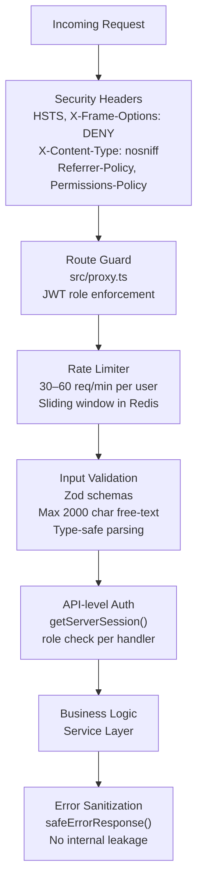

# AtomQuest — Detailed Architecture Diagram

## 1. System Overview (Top-Down Flow)

---

## 2. Frontend — Role-Based Dashboards

---

## 3. Authentication & Route Guard Flow

---

## 4. Goal Sheet Lifecycle State Machine

---

## 5. Quarterly Check-In Flow

---

## 6. Scheduler — Distributed Lock & Concurrency Control

---

## 7. Data Model — Entity Relationship

---

## 8. Redis — Caching & Rate Limiting Architecture

---

## 9. Security Layers

